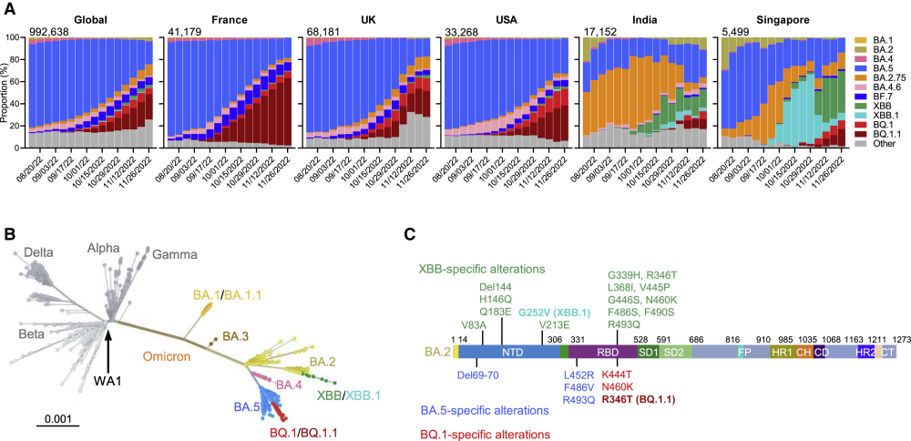
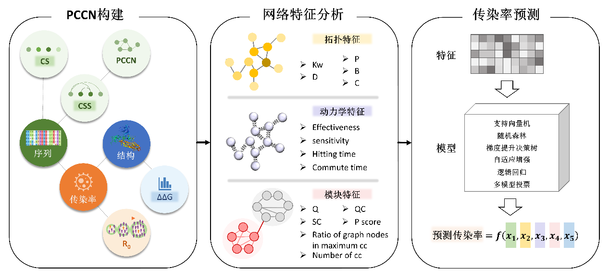
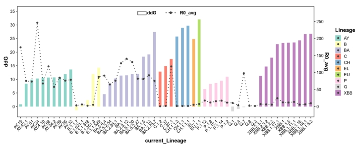
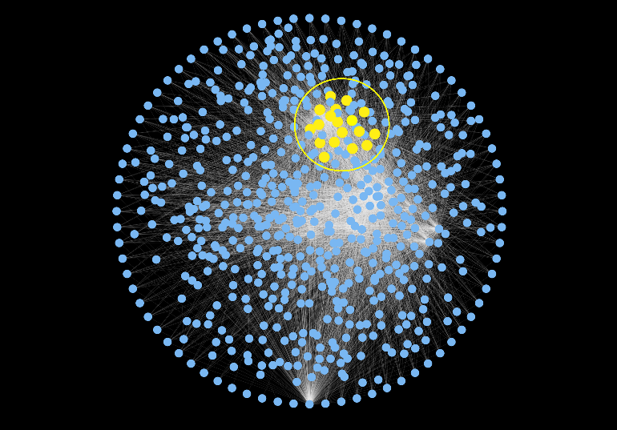
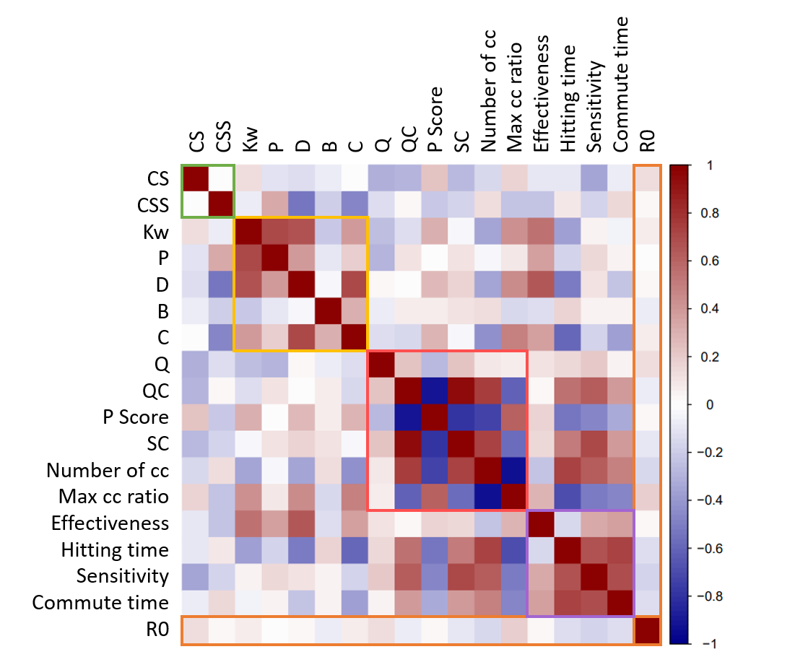

# CoCoNet
## 1.Introduction
The specific mutations that occur during the evolution of highly variable viruses will enhance their immune escape ability, which brings great challenges to the development of vaccines and drugs against them. Coronavirus Disease 2019 (Covid-19) virus is a kind of highly variable virus, which has evolved from the original strain to multi-lineage variant strains. We developed a machine learning model-based prediction software (CoCoNet) for the infectiousness of Covid-19 virus mutation lineages. By building a spike protein (S) of the conservative network topological index and calculate mutation module, CoCoNet predict Covid - 19 virus mutation spectrum the infection rate of accuracy is 0.72. Our approach investigates the lineage mutation of COVID-19 from a systems biology perspective and suggests the need for further consideration based on the binding affinity of S protein to its receptor.

- Covid-19 Omicron BQ.1、BQ.1.1、XBB and XBB's evolutionary relationships of subvariants, and their distribution on Spike proteins:

  

- CoCoNet's design ideas and calculation steps:

  
  
## 2.Usage
### Arguments description
- --input_fasta：the fasta format files or folders inputed
- --data_dir：Intermediate data storage path，default: "./data"
- --out_dir：Result storage path，default: "./data"
- --net：Whether to perform coconservative network construction，(default: True)
- --dy：Whether to calculate module topology characteristics or load from the existing results，(default: True)
- --mod：Whether to compute network dynamics features or load from existing results，(default: True)
- --method: usage model，(ensemble or single)(default: ensemble)

### Working flow

```shell
    # following are command lines
    # predict single variant

    python main.py --input_fasta var.fasta


    # predict a group of variants, stored in “input” directory

    python main.py --input_fasta ./input


    # skip network computing

    python main.py --input_fasta var.fasta --net


    # skip module feature computing

    python main.py --input_fasta var.fasta --mod 


    # skip dynamic feature computing

    python main.py --input_fasta var.fasta --dy


    # skip two of them

    python main.py --input_fasta var.fasta --net --dy
```

### Tips
When can you skip some of these steps?
- net: If the current mutation network data (xxx.fasta_threshold_100) has been saved in the './data/pccn/' directory, it can be skipped.
- dy: If the 'out_dir' directory already has dynamic feature.csv, you can skip it.
- mod: If the 'out_dir' directory saved module feature.csv, can be skipped.

## 3.Example
### 1) The prevalence rate of Spike protein mutation spectrum and energy calculation results
For all mutant lineages, we calculated the effect of a single mutation in each lineage on the structural stability of the S protein, where missing or increased mutation sites were omitted. AY. 24 lineages have the highest average transmission rate and the mutation contains D614G, T19R, T478K, L452R, P681R, A222V, EFR156-158 - g, T778, D950N, G142D, including mutation T778 is ignored in the process of calculation.

- Spike protein mutation spectrum of typical spectrum of multiple locus mutation effects on structural stability:



### 2) Coconservation network and comutation module of Spike protein
Based on the CCS scores calculated from the protein sequences, a weighted network of protein copreservation was constructed for the spiking proteins. S 1273 amino acids in proteins, corresponding to a network of 1273 nodes. In all possible residues on, has the strong conservative as the network edge, and the weight of edge for CCS. Therefore, PCCN model can reveal the residues from the perspective of network information were conservative.

- Schematic diagram of the coconservation network and the comutation module:



### 3) Correlation between module-based network metrics and mutation contagion
The co-mutant module characteristics in terms of conservation, network topology, module structure and dynamics of each line were summarized, and the Spearman correlation coefficient with the average mutation infection rate R0 was calculated to measure their consistency with the change trend of Covid-19 virus infectivity.

- Heatmap of the correlation between variant features and R0:




